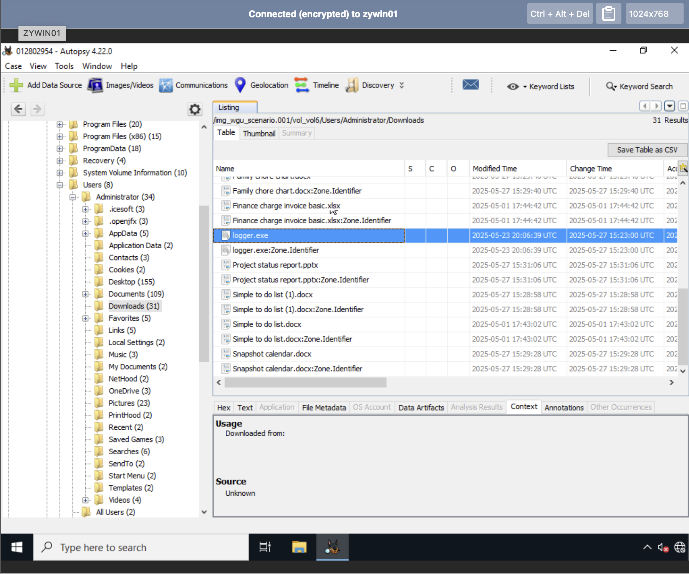

# 🔍 Digital Forensics Investigation (Autopsy)

## 📌 Overview
Conducted a forensic analysis of a Windows 11 disk image using Autopsy to identify suspicious activity, recover deleted files, and analyze system artifacts related to possible unauthorized access and data exfiltration.

---

## 🎯 Objectives
- Identify evidence of unauthorized access  
- Analyze user activity and system artifacts  
- Recover deleted or hidden files  
- Determine indicators of potential data exfiltration or malicious behavior  

---

## 🛠 Tools Used
- Autopsy 4.22.0  
- Windows 11 forensic disk image  
- FTK Imager  

---

## 🔎 Investigation Process

### 1. Event Log Analysis
I reviewed Windows event logs within the forensic image to identify authentication activity, system events, and evidence that could help reconstruct system usage and possible unauthorized access.

**Evidence Notes:**  
Windows event logs such as `Security.evtx` and `System.evtx` were located under `Windows\System32\winevt\Logs`, providing valuable system and authentication artifacts.

---

### 2. Suspicious User Documents
I examined the Administrator user profile and identified a suspicious planning document located in the Documents folder.

**Evidence Notes:**  
The file `todo.docx` was located in `Users\Administrator\Documents`, suggesting potential planning or staging activity tied to the user account.

---

### 3. Suspicious Executable Discovery
I reviewed the Downloads folder and identified an unexpected executable file.

**Evidence Notes:**  
The file `logger.exe` was identified in the Administrator Downloads folder. Its location and name made it stand out as potentially suspicious and relevant to the investigation.

---

### 4. Deleted File Recovery
I recovered a deleted file that contained especially important evidence.

**Evidence Notes:**  
The deleted file `secret.txt` contained instructions involving confidential information, an external email address, and guidance to remove evidence afterward. This strongly suggested deliberate malicious intent and attempted concealment.

---

### 5. System Event Review
I also reviewed system-level event logs to help understand overall system activity and timeline context.

**Evidence Notes:**  
The `System.evtx` log helped establish system-level activity such as startup, shutdown, and service-related events relevant to the investigation timeline.

---

### 6. Browser Artifact Analysis
I analyzed browser-related artifacts, including cookies, to confirm access to external websites.

**Evidence Notes:**  
Browser cookies associated with Microsoft Edge showed evidence of access to external domains, helping establish browsing behavior and external site interaction.

---

### 7. Prefetch Analysis
I reviewed Windows Prefetch data to identify evidence of executed applications.

**Evidence Notes:**  
Prefetch entries for `MSEDGE.EXE` confirmed browser execution on the system and supported timeline reconstruction of user activity.

---

### 8. Browser History Analysis
I examined browser history artifacts to identify specific sites accessed from the system.

**Evidence Notes:**  
Browser history showed access to external websites, providing additional insight into user activity and system usage during the relevant timeframe.

---

## 🚨 Key Evidence Identified

### Suspicious Document
- File: `todo.docx`  
- Location: `Users\Administrator\Documents`  
- Relevance: Possible planning or preparation activity  

### Unauthorized Executable
- File: `logger.exe`  
- Location: `Users\Administrator\Downloads`  
- Relevance: Suspicious executable in user download location  

### Deleted Sensitive File
- File: `secret.txt`  
- Relevance: Included instructions involving confidential information, outside communication, and evidence deletion  

### Browser Artifacts
- Evidence of external website access through cookies and browser history  

### Program Execution
- Prefetch artifacts confirmed execution of Microsoft Edge  

### Event Logs
- Security and system event logs helped support timeline reconstruction and system activity analysis  

---

## 🧠 Conclusion
The forensic investigation revealed multiple artifacts indicating suspicious and potentially malicious activity on the Windows 11 system. The most significant findings included a suspicious executable (`logger.exe`), a planning-related document (`todo.docx`), and a deleted text file (`secret.txt`) containing instructions consistent with data exfiltration and concealment.

Taken together, the recovered files, browser artifacts, event logs, and execution evidence indicate likely unauthorized data handling and potential data exfiltration activity.

---

## 💡 Skills Demonstrated
- Digital Forensics Analysis  
- Artifact Identification  
- Deleted File Recovery  
- Windows Event Log Analysis  
- Browser Artifact Analysis  
- Prefetch Analysis  
- Evidence Documentation  
- Investigative Thinking  

---

## 🧠 Analyst Decision

**Severity:** Medium  

**Verdict:** Suspicious Activity Identified  

**Key Indicators:**  
- Presence of suspicious executable (`logger.exe`)  
- Planning-related document (`todo.docx`) found in user directory  
- Deleted file (`secret.txt`) containing instructions for data handling and concealment  
- Browser artifacts indicating external website access  
- Prefetch evidence confirming program execution  

**Summary:**  
The forensic analysis identified multiple artifacts consistent with suspicious user activity, including unauthorized files, evidence of external communication, and deliberate deletion of sensitive data. While intent cannot be definitively confirmed, the findings strongly suggest potential data exfiltration and policy violations.

**Recommended Actions:**  
- Perform deeper analysis of `logger.exe`  
- Review user activity timeline for unauthorized actions  
- Preserve and document evidence for further investigation  
- Assess potential data exposure and external communication  
