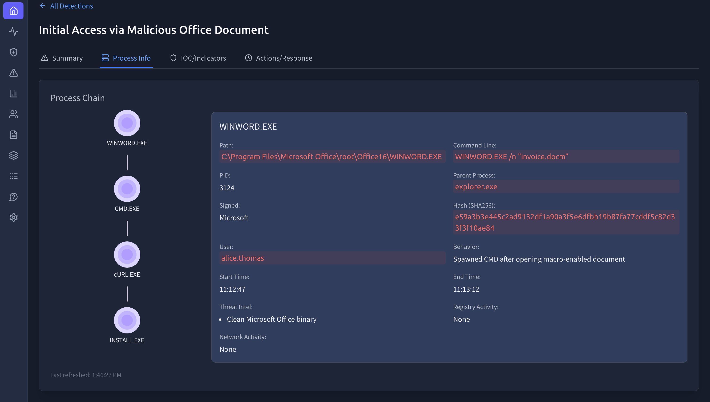
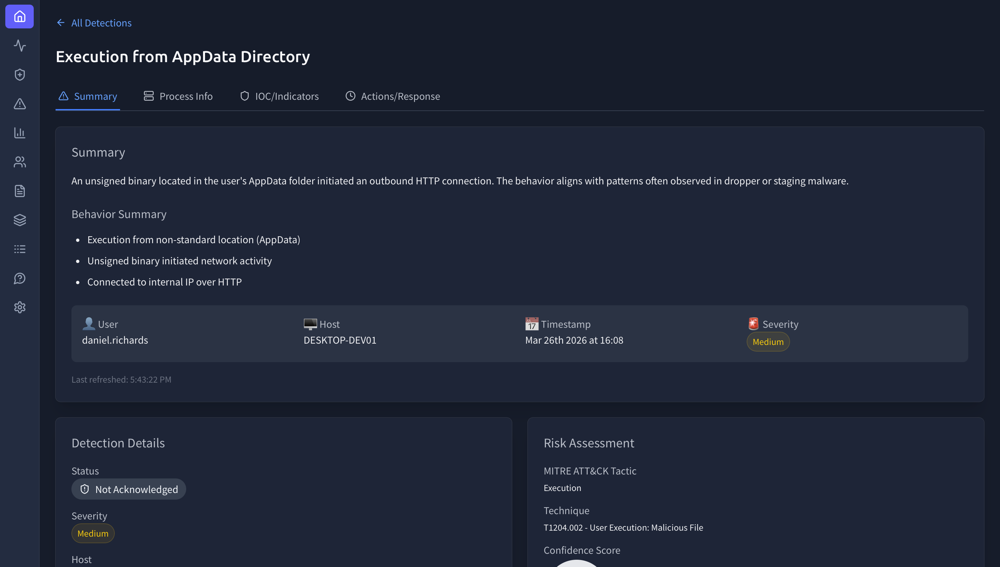

# 🛡️ EDR Alert Investigation Lab (SOC Analyst Simulation)

## 📌 Objective
Analyze multiple alerts within an Endpoint Detection & Response (EDR) platform to identify attacker behavior, validate automated security actions, and determine appropriate analyst response.

This investigation focuses on correlating process activity, identifying indicators of compromise (IOCs), and assessing threat impact across multiple endpoints.

---

## 🖥️ Environment
- Platform: TryHackMe (EDR Simulation)
- Tool: Simulated EDR Dashboard
- Scope: Multiple endpoints across an enterprise environment

---

## 🚨 Alert 1: Initial Access via Malicious Office Document

### Summary
A macro-enabled Word document (`invoice.docm`) was opened by the user, triggering a sequence of suspicious processes that attempted to download an external payload.

### Process Chain

WINWORD.EXE → CMD.EXE → cURL.EXE → install.exe

### Analysis
The execution of a command shell from Microsoft Word strongly indicates macro-based exploitation. The use of `cURL` to retrieve an external payload suggests staged malware delivery.

Although the payload was written to disk, there is no evidence of execution, indicating that the attack was interrupted during the initial access phase.

### Key Findings
- Malicious macro execution from Office document  
- Word spawning CMD (high-confidence malicious behavior)  
- External payload retrieval attempt via `cURL`  
- Payload successfully written but not executed  

### Indicators of Compromise (IOCs)
- File: `install.exe`  
- Domain: `files-wetransfer.com`  
- IP Address: `1.161.138.92`  

### Response Actions (EDR Observed)
- Malicious file quarantined  
- External domain and IP blocked  
- Alert generated and logged  

### Analyst Assessment
- Confirmed **True Positive**
- Attack aligns with phishing-based initial access (MITRE T1566)
- Early-stage containment prevented full compromise  

**Recommendation:**
- Enforce macro restrictions via Group Policy  
- Implement email filtering for macro-enabled attachments  
- Conduct user awareness training on phishing risks  

---

## 🚨 Alert 2: Credential Dumping via LSASS Memory Access

### Summary
A suspicious binary (`syncsvc.exe`) accessed LSASS process memory, indicating potential credential dumping activity.

### Process Chain

explorer.exe → syncsvc.exe → lsass.exe

### Analysis
Access to LSASS memory is a high-confidence indicator of credential dumping activity. The execution of a binary from the AppData directory further increases suspicion, as attackers frequently leverage user-space directories to evade detection.

The presence of a registry-based persistence mechanism suggests the attacker intended to maintain long-term access.

### Key Findings
- Unauthorized LSASS memory access  
- Execution from AppData temporary directory  
- Registry-based persistence mechanism identified  
- Behavior consistent with credential harvesting tools  

### Indicators of Compromise (IOCs)

- File: `syncsvc.exe`  
- Path: `C:\Users\haris.khan\AppData\Local\Temp\syncsvc.exe`  
- Domain: `files-wetransfer.com`  
- Registry Key: `HKCU\...\Run\syncsvc`  

### Response Actions (EDR Observed)
- Malicious binary quarantined  
- Outbound connections blocked  
- Persistence mechanism flagged  

### Analyst Assessment
- Confirmed **True Positive**
- Matches MITRE ATT&CK technique: **T1003 – Credential Dumping**
- High severity due to potential credential compromise  

**Recommendation:**
- Immediately isolate affected host  
- Reset credentials for impacted user  
- Conduct lateral movement investigation  
- Review authentication logs for abnormal access  

---

## 🚨 Alert 3: Execution from AppData Directory

### Summary
An executable (`UpdateAgent.exe`) was detected running from a user AppData directory and initially flagged due to its unusual execution path.

### Analysis
Execution from AppData is commonly associated with malicious activity; however, further investigation showed that the binary communicated only with internal infrastructure and matched a known internal tool.

This highlights the importance of validating alerts before escalation.

### Key Findings
- Execution from non-standard directory (AppData)  
- Internal network communication only  
- No suspicious or malicious behavior observed  

### Indicators of Compromise (IOCs)
- File: `UpdateAgent.exe`  
- Path: `C:\Users\daniel.richards\AppData\Roaming\UpdateAgent.exe`  
- IP Address: `10.10.20.5`  

### Threat Intelligence Classification
**Known internal IT utility tool**

### Response Actions (EDR Observed)
- Activity logged  
- File marked safe by internal database  
- No containment action taken  

### Analyst Assessment
- Confirmed **False Positive**
- Demonstrates importance of contextual analysis  
- No remediation required  

**Recommendation:**
- Add file hash to allowlist  
- Tune detection rules to reduce noise  
- Continue monitoring for anomalies  

---

## 🧠 MITRE ATT&CK Mapping

- **T1566 – Phishing (Initial Access)**  
- **T1059 – Command Execution**  
- **T1003 – Credential Dumping**  
- **Persistence via Registry (T1547)**  

---

## 📊 Conclusion

This investigation demonstrates the ability to:

- Analyze and triage EDR alerts across multiple endpoints  
- Correlate process activity and execution chains  
- Identify and validate indicators of compromise (IOCs)  
- Distinguish between true positives and false positives  
- Apply threat intelligence and MITRE ATT&CK mapping  
- Recommend appropriate incident response actions  

---

## 🧠 Key Takeaway

Effective SOC analysis requires more than acknowledging alerts. It involves validating activity, understanding attacker behavior, and applying context to determine whether an event represents a real threat.

This investigation reflects real-world SOC workflows by combining detection, analysis, and response into a structured investigative process.pret, and assess the activity to ensure accurate threat detection and response.

