# 🔎 Elastic SIEM Investigation: VPN Log Analysis

## 📌 Overview
This project documents a VPN log investigation performed in Elastic using the `vpn_connections` dataset. The objective was to review connection activity, identify abnormal user behavior, investigate suspicious IP activity, analyze failed authentication attempts, and apply KQL-based filtering to answer targeted investigative questions.

This investigation demonstrates practical SOC analyst workflow using Elastic Discover, including baseline log review, user and IP analysis, time-based spike investigation, and post-termination account review.

---

## 🎯 Objectives
- Establish a baseline view of VPN activity
- Identify the users and IP addresses generating the most activity
- Investigate a specific user account for repeated connections
- Examine suspicious source IP activity outside an expected geographic region
- Analyze failed connection attempts and identify the user responsible for the majority of them
- Review possible post-termination account activity
- Apply KQL queries for filtered investigations

---

## 🛠 Tools Used
- Elastic Discover
- KQL (Kibana Query Language)
- TryHackMe lab environment
- VPN connection log dataset (`vpn_connections`)

---

## 🔍 Investigation Steps

### 1. Baseline VPN Activity Review
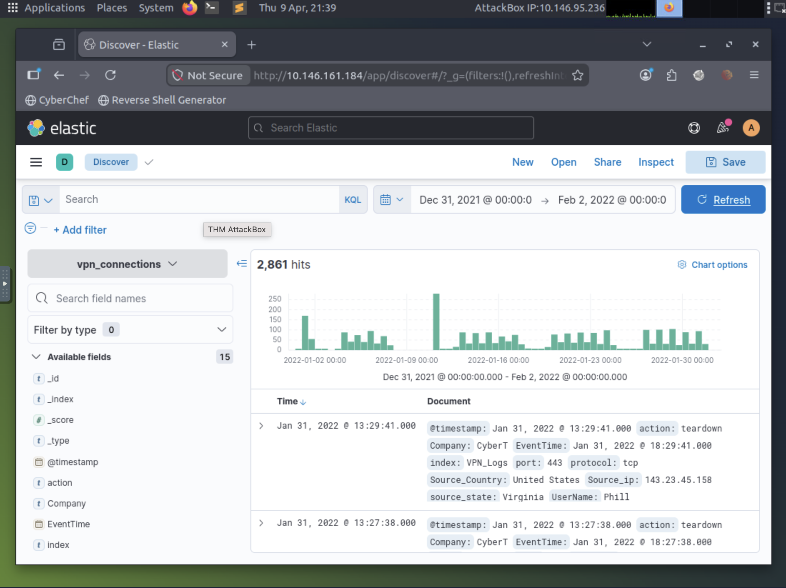

Total events observed: 2,861  
Used to establish a baseline and understand normal VPN traffic patterns.

---

### 2. Top User Activity Overview
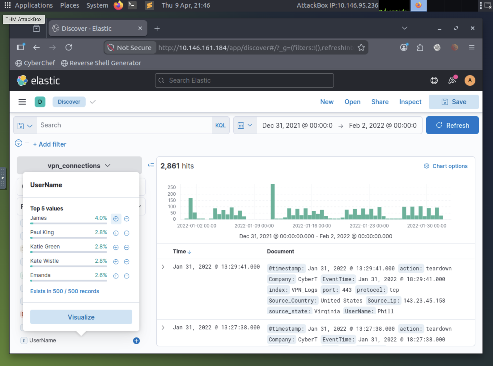

**Key Observation:**
- James generated the highest volume of VPN activity.
- Other users present: Paul King, Katie Green, Kate Wistle, Emanda.

---

### 3. User-Focused Investigation – Emanda
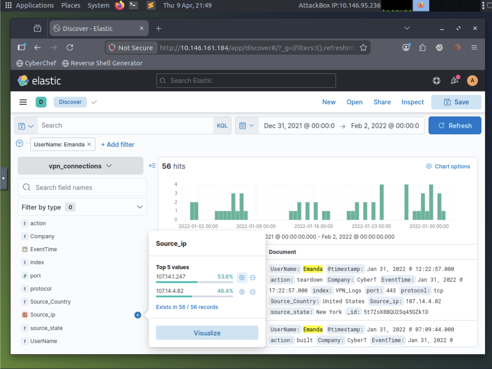

Total events for Emanda: 56  
This step isolates a single user to identify abnormal patterns.

---

### 4. Source IP Review for Emanda


Top IPs for Emanda:
- 107.14.1.247
- 107.14.4.82

---

### 5. Geographic Exclusion Analysis
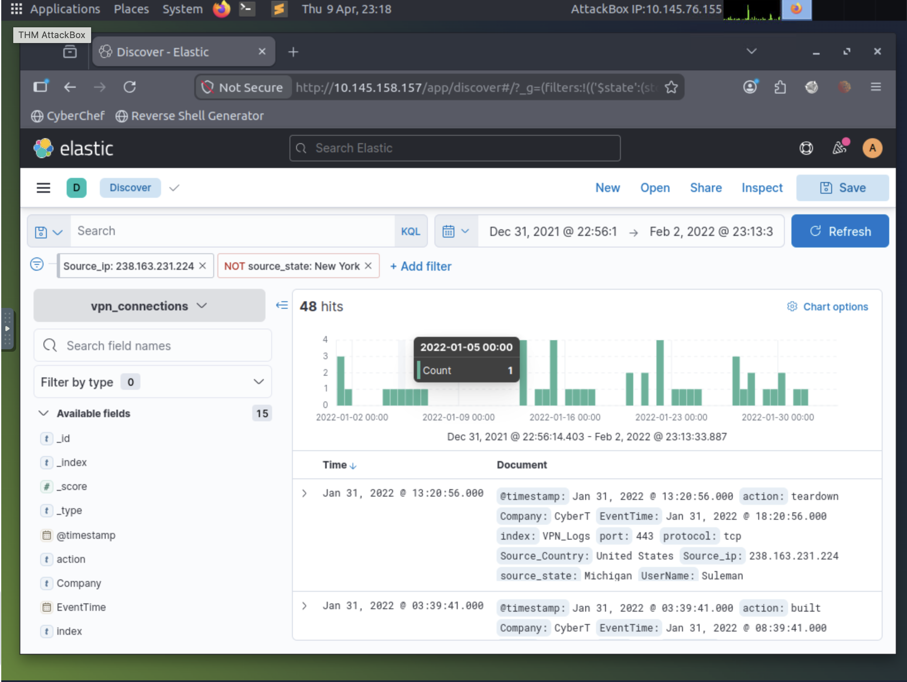

Filtered on:
- Source IP: 238.163.231.224
- Excluding New York

Total events found: 48

---

### 6. Failed Connection Review
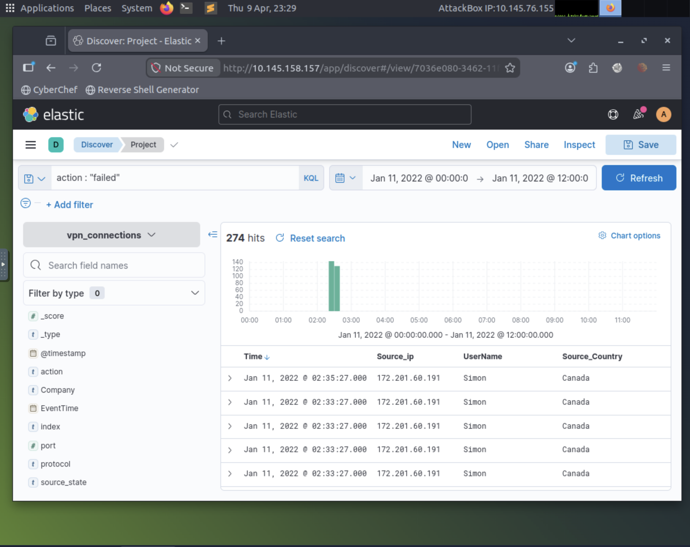

Failed logins showed a spike around Jan 11, 2022.

---

### 7. Time-Based Spike Investigation
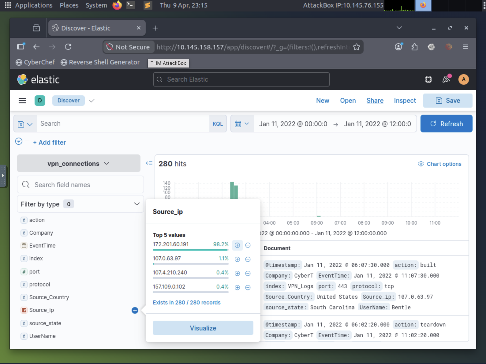

The spike was driven by IP:
- 172.201.60.191

---

### 8. Source IP Distribution During Spike
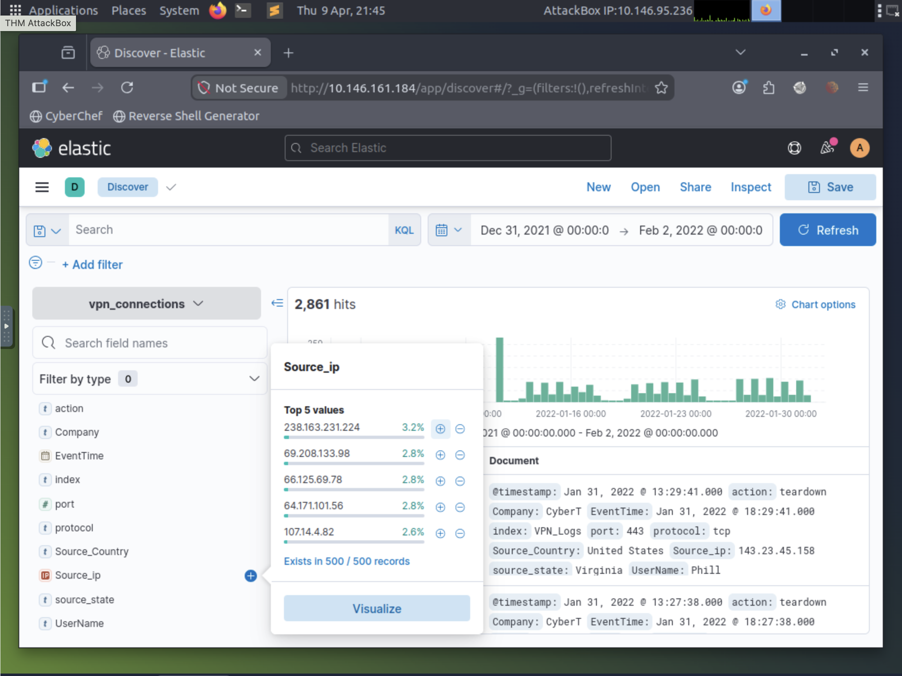

172.201.60.191 dominated activity during this time window.

---

### 9. Post-Termination Activity – Johnny Brown
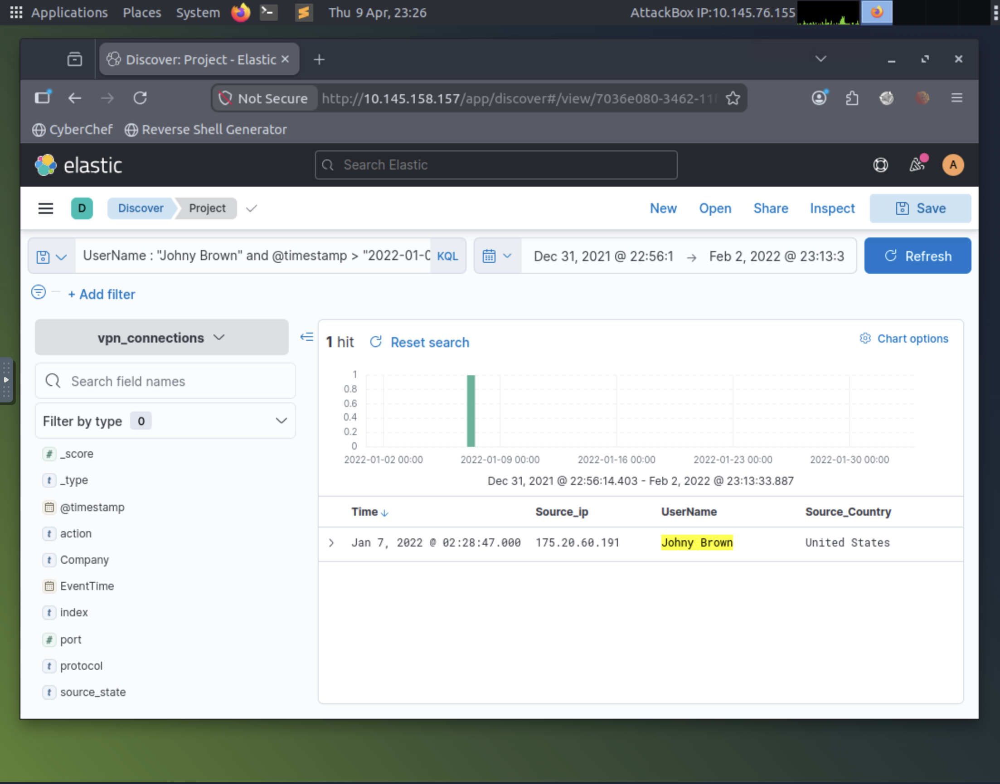

Query Used:
```
UserName : "Johny Brown" and @timestamp > "2022-01-01"
```

1 event identified after termination date.

---

### 10. U.S. User Filtering (James & Albert)
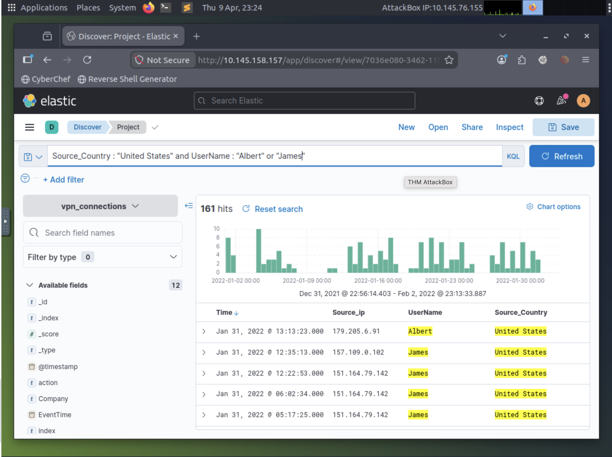

Query:
```
Source_Country : "United States" and UserName : "Albert" or "James"
```

Total results: 161

---

### 11. User Distribution (Focused Window)
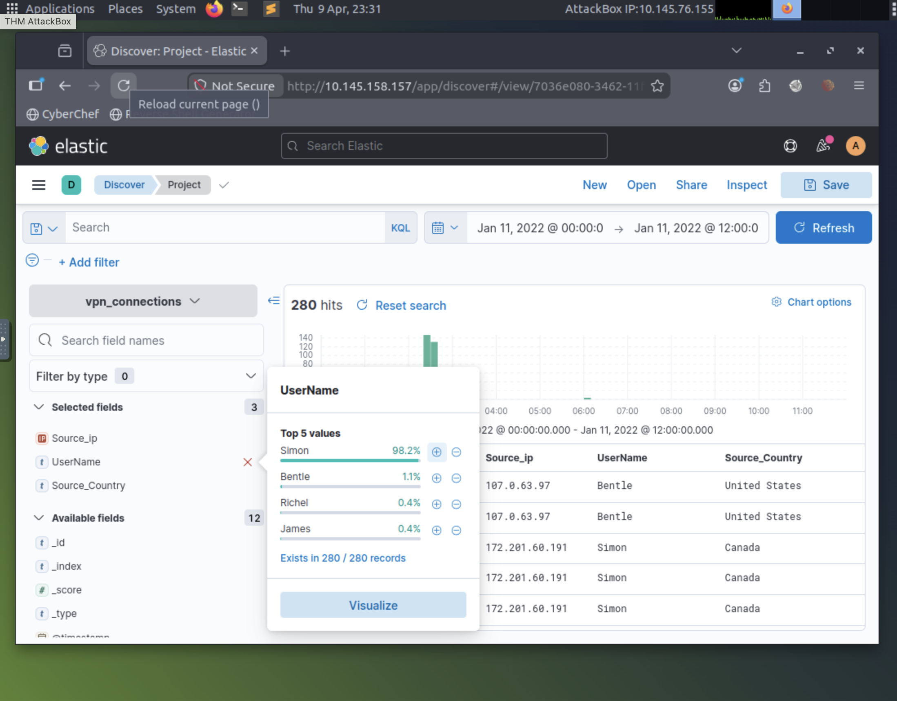

Simon dominated activity in this time window.

---

### 12. Range Validation / No Results
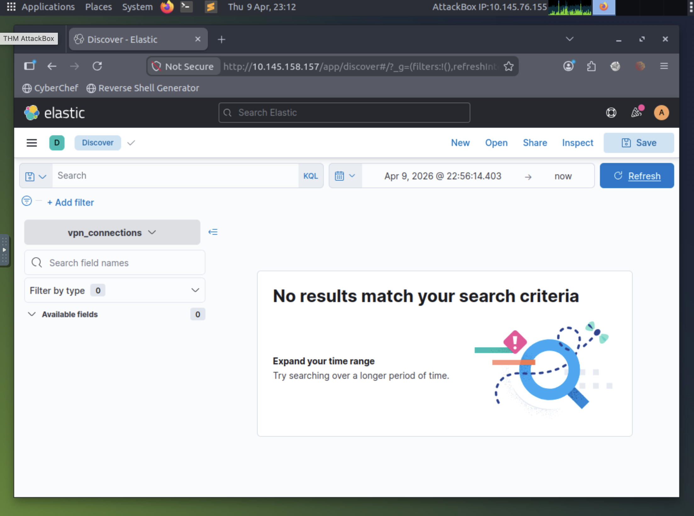

This demonstrates why validating time ranges is critical when troubleshooting missing logs.

---

## 🚨 Key Findings
- 2,861 total VPN events
- James was the highest activity user overall
- Emanda generated 56 events from two IPs
- 238.163.231.224 had 48 events when excluding New York
- 172.201.60.191 drove a major spike in activity
- Johnny Brown showed activity post-termination
- U.S.-based filtering revealed 161 events tied to James & Albert

---

## 🧠 Skills Demonstrated
- SIEM log analysis
- KQL querying
- User & IP pivoting
- Failed login detection
- Geographic filtering
- Timeline analysis
- Post-termination access review

---

## 📌 Conclusion
This investigation demonstrates core SOC skills: log review, anomaly detection, targeted filtering, and reporting. Using Elastic and KQL, suspicious patterns were identified, investigated, and documented.
