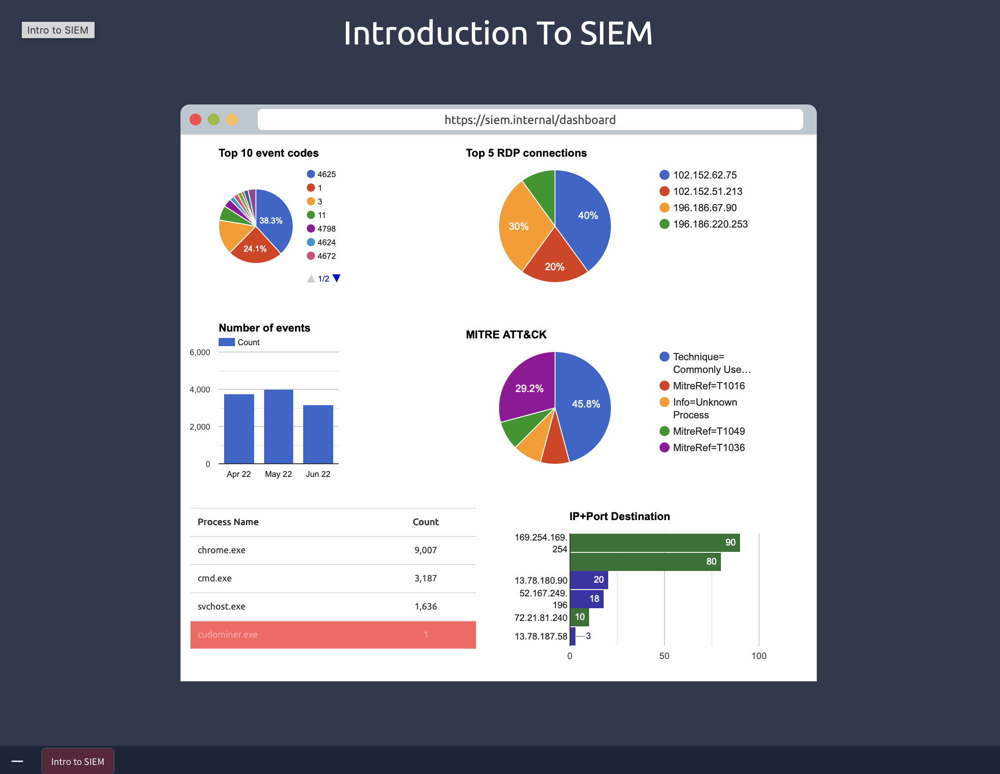
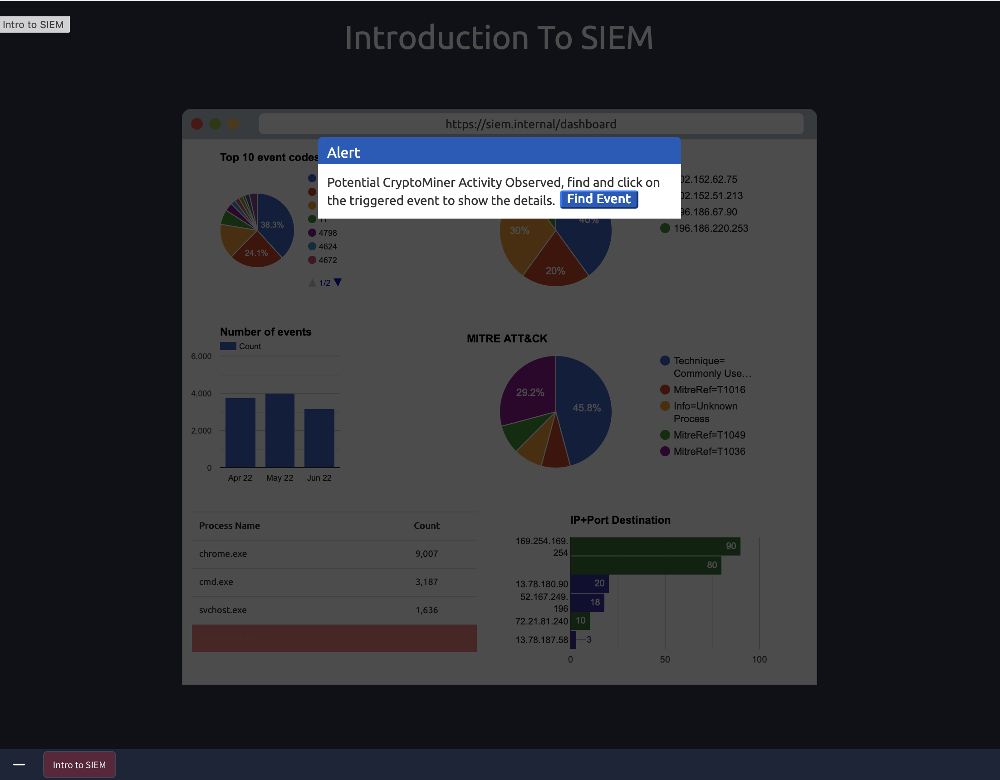
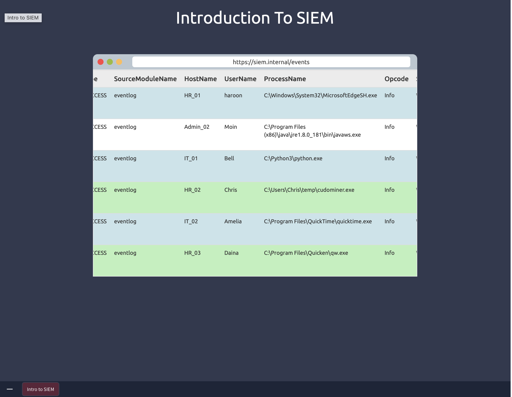
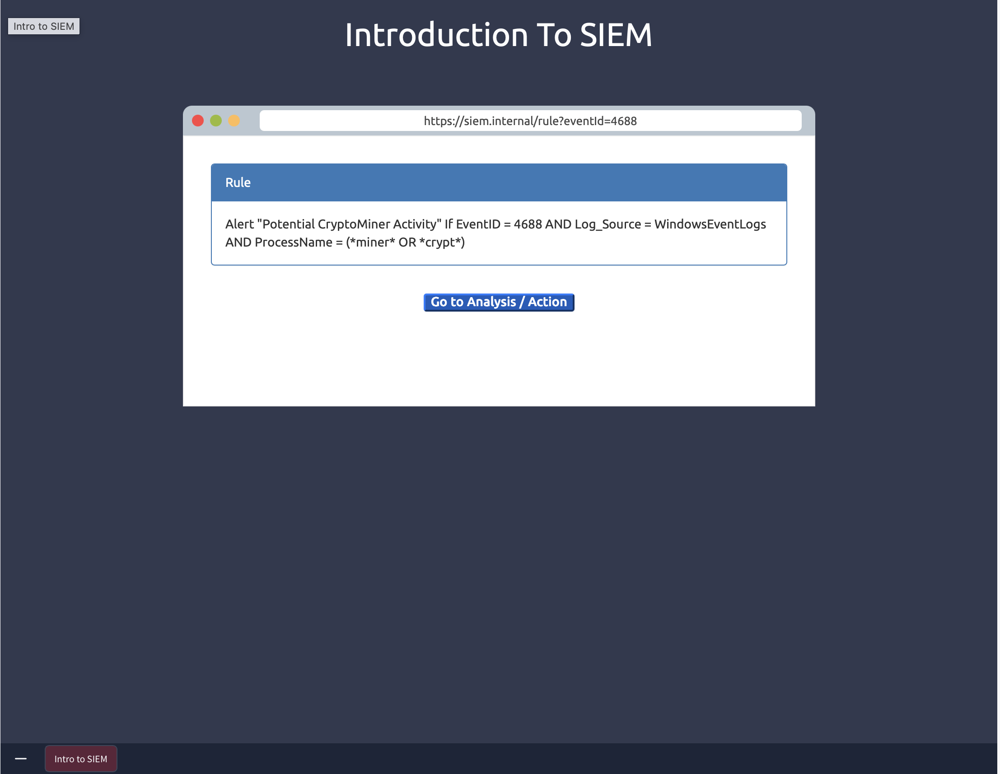
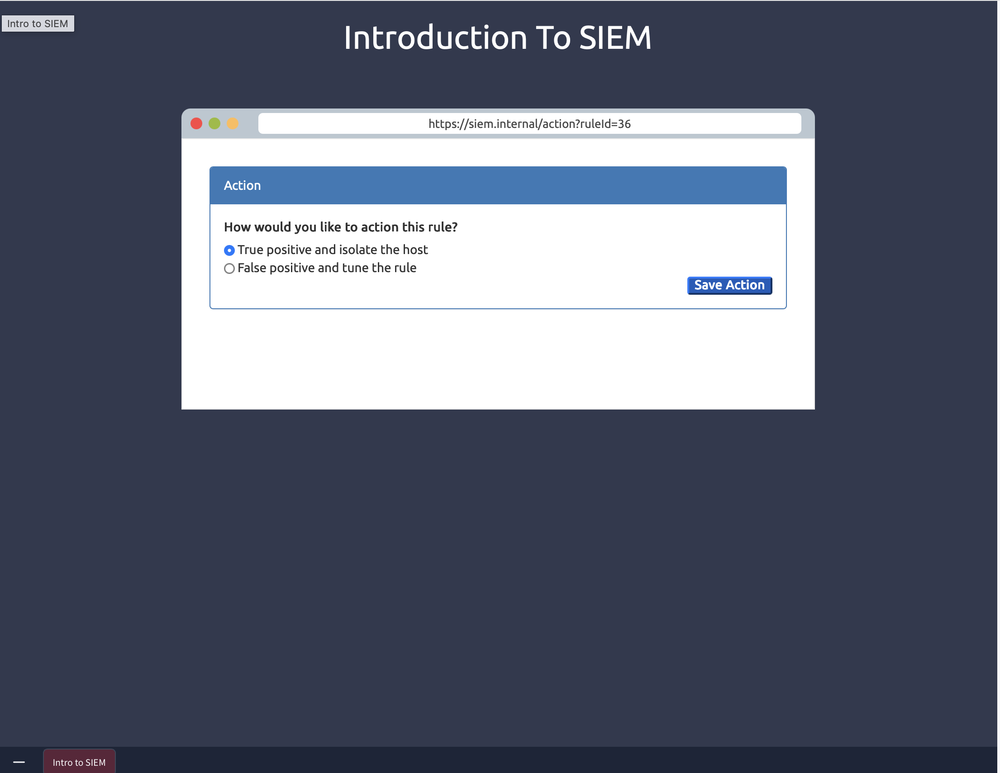

# 🔐 SIEM Investigation: CryptoMiner Detection

## Overview
During routine SIEM monitoring, an alert was triggered indicating potential cryptomining activity on an endpoint. This investigation validates the alert, analyzes supporting evidence, and determines appropriate response actions.

---

## 1. SIEM Dashboard Analysis

Initial review identified an anomalous process (`cudominer.exe`) not consistent with baseline system activity.

### Analyst Notes
- `cudominer.exe` is not a legitimate Windows process  
- Low execution count suggests recent or isolated activity  
- Likely introduced via user execution or a dropped payload  

---

## 2. Alert Triggered

The SIEM generated an alert for **Potential CryptoMiner Activity**, triggered by detection rules matching suspicious process names.

### Analyst Interpretation
The alert indicates possible unauthorized resource usage consistent with cryptomining behavior.

---

## 3. Event Investigation

Event log analysis identified:

- **Host:** HR_02  
- **User:** Chris  
- **Process Path:** `C:\Users\Chris\temp\cudominer.exe`  

### Key Observations
- Execution from `Temp` directory → **highly suspicious**  
- User-level execution → potential phishing or malicious download  
- Process name includes “miner” → aligns with detection logic  

---

## 4. Detection Rule Analysis

The alert was triggered based on:

- **Event ID:** 4688 (Process Creation)  
- **Rule logic:** Process name contains `miner` or `crypt`  

### Analyst Insight
The rule effectively detects cryptomining indicators but may require additional tuning (e.g., file path, parent process) to reduce false positives. In this case, strong contextual indicators increase confidence in malicious activity.

---

## 5. IOC Analysis

### Identified Indicators of Compromise

- Process: `cudominer.exe`  
- File Path: `C:\Users\Chris\temp\`  
- Host: `HR_02`  
- Event ID: `4688`  

### Threat Context
Cryptominers are commonly:
- Delivered via phishing or malicious downloads  
- Executed from temporary or user-controlled directories  
- Designed to persist while consuming system resources  

---

## 6. MITRE ATT&CK Mapping

- **T1496 – Resource Hijacking**  
- **T1059 – Command Execution**  

---

## 7. Incident Response

The alert was classified as a **True Positive**, and the affected host was isolated to prevent further execution.

---

## 🧠 Analyst Decision

**Severity:** High  

**Verdict:** True Positive  

**Key Indicators:**  
- Suspicious process (`cudominer.exe`)  
- Execution from temporary directory (`C:\Users\Chris\temp\`)  
- SIEM rule match for cryptomining behavior  
- Process creation event (Event ID 4688)  

**Summary:**  
The investigation confirmed unauthorized cryptomining activity based on process behavior, execution path, and SIEM alert correlation. The activity indicates compromise or misuse of system resources.

**Recommended Actions:**  
- Isolate affected endpoint  
- Remove malicious executable  
- Investigate initial access vector  
- Perform environment-wide IOC sweep  
- Strengthen endpoint detection and monitoring controls  

---

## 8. Recommendations

- Implement application control / allowlisting  
- Enhance monitoring of temporary directories  
- Tune detection rules with additional context  
- Perform endpoint threat hunting for similar indicators  
- Investigate initial access vector (phishing or download)  
- Strengthen endpoint protection controls  

---

## Conclusion

This investigation confirmed unauthorized cryptomining activity on a corporate endpoint. The SIEM detection rule successfully identified the threat based on process behavior and naming patterns.

This scenario demonstrates:
- Validation of SIEM alerts using supporting evidence  
- Identification of suspicious execution paths  
- Application of structured SOC analysis  
- Effective incident response and containment  

---

## 🧠 Key Takeaway

Effective SIEM analysis requires validating alerts with context, correlating system activity, and applying investigative reasoning to determine impact and response.
