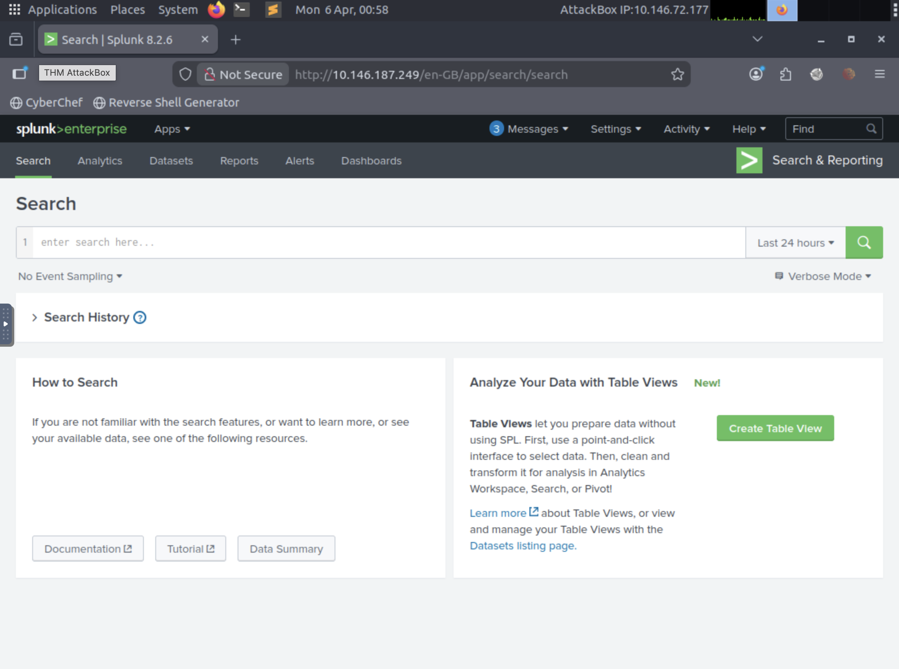
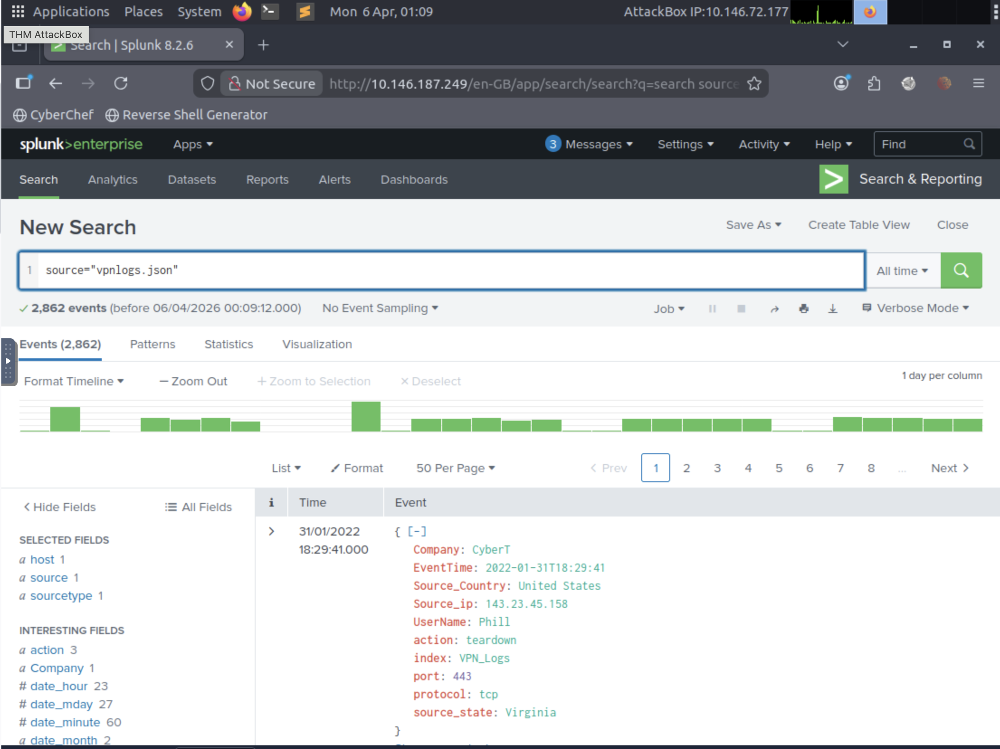
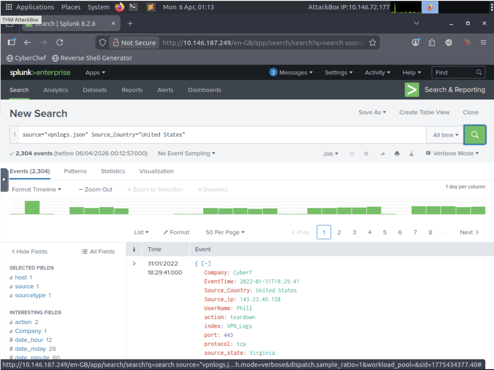
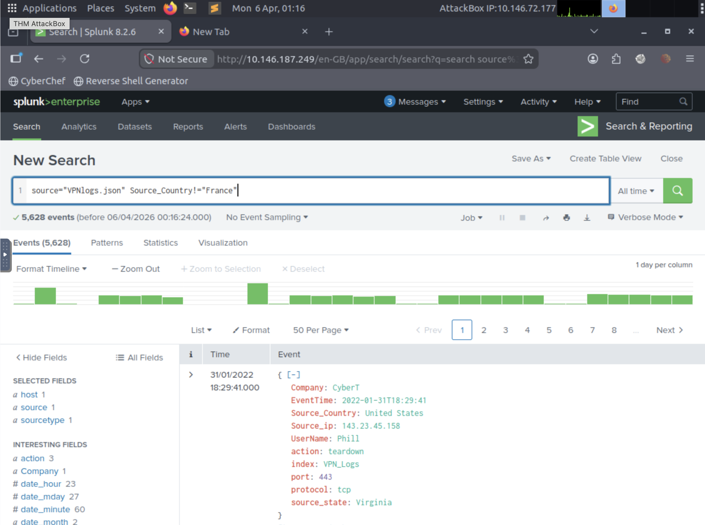

# 🔎 Splunk SIEM Investigation: VPN Log Analysis

## 📌 Overview
Conducted a SIEM-based investigation using Splunk to analyze VPN log data, identify user-specific activity, and evaluate geographic access patterns.

This investigation demonstrates the ability to ingest log data, perform targeted searches, and apply analytical filtering to identify meaningful patterns within network activity.

---

## 🎯 Objective
- Ingest VPN log data into Splunk
- Identify total event volume
- Analyze activity for a specific user
- Investigate geographic distribution of events
- Apply filtering techniques to refine analysis

---

## 🖥️ Environment
- Platform: TryHackMe (Splunk Lab)
- Tool: Splunk Enterprise 8.x
- Data Source: VPN log dataset (JSON format)

---

## 📥 Data Ingestion

VPN log data was successfully uploaded into Splunk and indexed for analysis.

---

## 📊 Total Event Analysis

A baseline search was performed to determine total log volume.

**Findings:**
- Total events ingested: **2,862**

---

## 👤 User Activity Investigation – Maleena

Filtered logs to identify all activity associated with user **Maleena**.

**Findings:**
- Total events associated with user: **60**
- Events include connection teardown activity and associated IP addresses

---

## 🌎 Geographic Activity Analysis – United States

Filtered logs to isolate events originating from the United States.

**Findings:**
- Majority of activity originated from U.S.-based IP addresses
- Consistent connection patterns observed across multiple events

---

## 🌍 Geographic Filtering – Excluding France

Applied exclusion filtering to identify all events originating from countries other than France.

**Findings:**
- Events outside France: **2,814**
- Demonstrates ability to refine datasets using conditional filtering

---

## 🔍 Key Observations

- VPN activity is distributed across multiple geographic locations  
- User-specific filtering allows targeted investigation of individual behavior  
- Geographic filtering supports anomaly detection and threat hunting  
- Log data includes key fields such as IP address, country, protocol, and action  

---

## 🧠 Analyst Assessment

- No immediate malicious activity identified in this dataset  
- Activity appears consistent with normal VPN usage patterns  
- However, geographic filtering techniques can be used to detect anomalies such as:
  - Unexpected foreign access  
  - Impossible travel scenarios  
  - Suspicious login patterns  

---

## 🛠️ Skills Demonstrated

- SIEM log ingestion and validation  
- Splunk search and filtering (SPL)  
- User-based activity investigation  
- Geographic analysis of network logs  
- Data interpretation and analytical reasoning  

---

## 📌 Conclusion

This investigation demonstrates practical experience using Splunk to analyze log data, perform targeted queries, and extract meaningful insights from VPN activity.

By applying structured analysis and filtering techniques, this project reflects real-world SOC workflows used to monitor and investigate network behavior.
